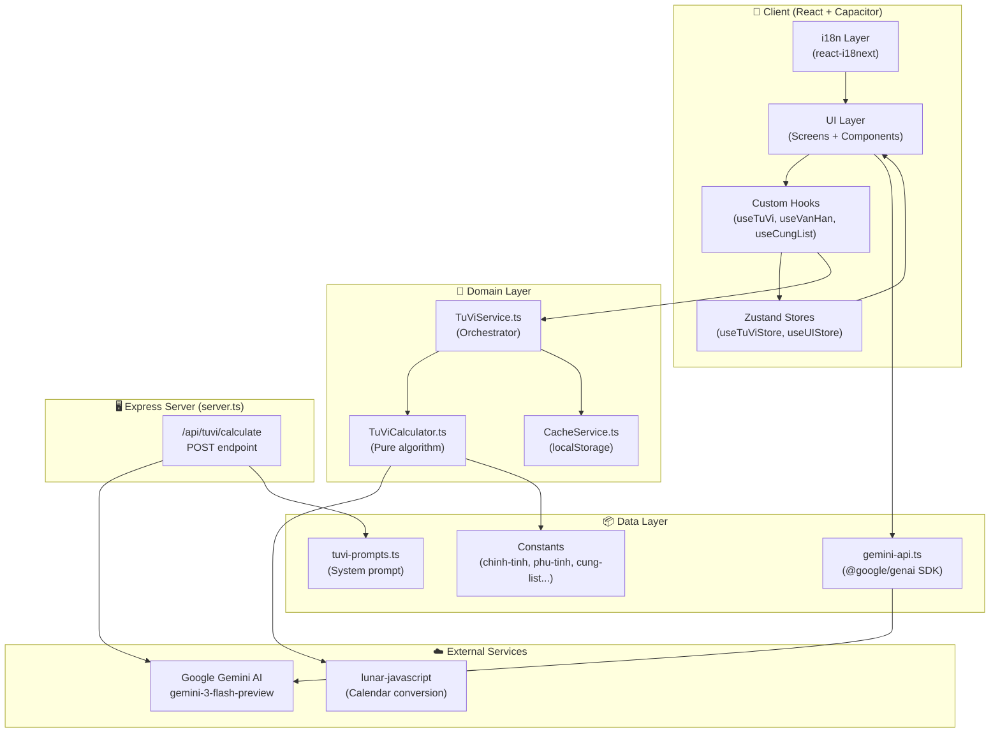
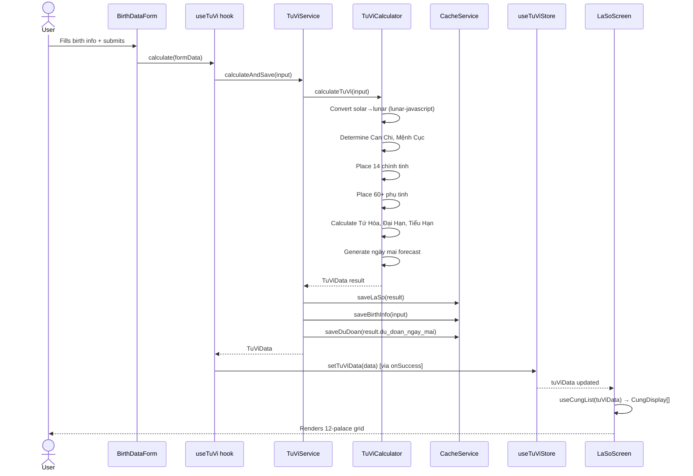
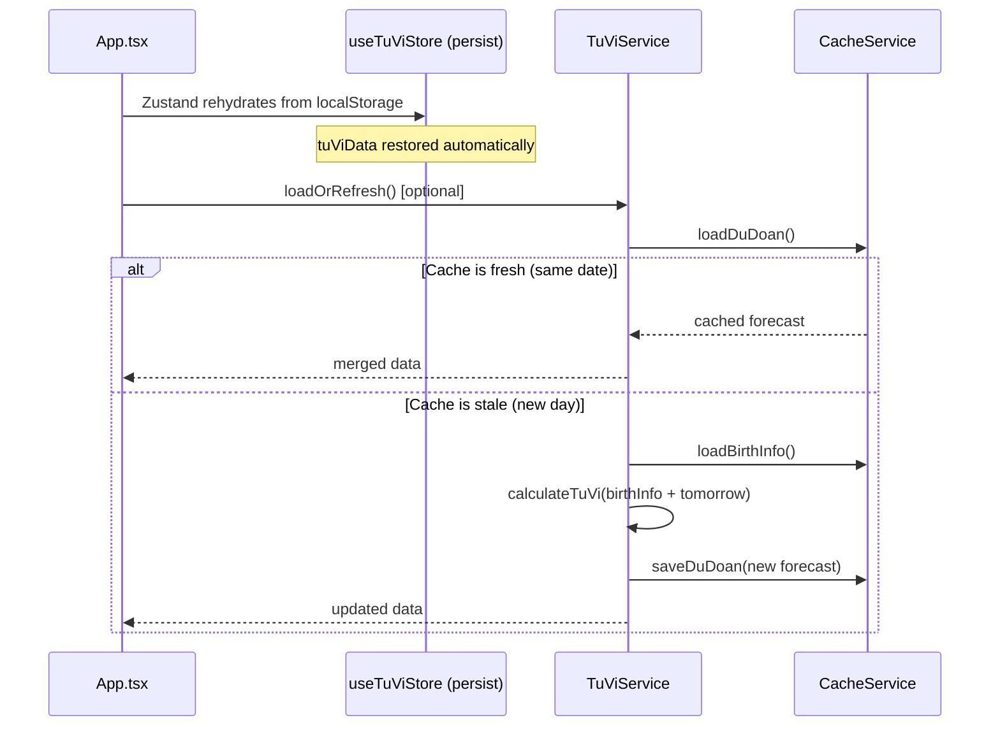
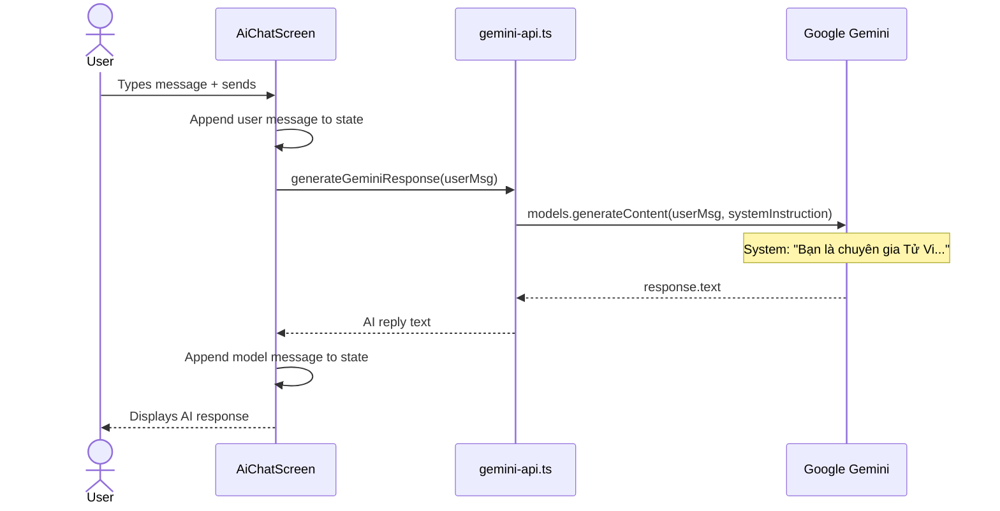

# 01 — Architecture & System Design

> Cross-reference: See [03-frontend](../03-frontend/README.md) for component details, [02-backend](../02-backend/README.md) for API layer details.
> GitNexus workflow: See [gitnexus-vibe-coding.md](./gitnexus-vibe-coding.md) for the repo-specific cheat sheet used to navigate this codebase quickly.

---

## High-Level Architecture



---

## Core Modules and Responsibilities

### 1. `src/domain/services/TuViCalculator.ts`
The heart of the application. A pure TypeScript implementation of the Tử Vi Đẩu Số algorithm (~987 lines). Responsibilities:
- Convert solar ↔ lunar calendar using `lunar-javascript`
- Determine Can Chi (Heavenly Stems + Earthly Branches) for year, month, day, hour
- Calculate Mệnh Cục (destiny element: Water/Wood/Fire/Earth/Metal)
- Place all 14 main stars (chính tinh) across 12 palaces
- Place 60+ auxiliary stars (phụ tinh) using lookup tables
- Calculate Tứ Hóa (4 transformations: Lộc/Quyền/Khoa/Kỵ)
- Calculate Đại Hạn (10-year destiny periods) and Tiểu Hạn (yearly cycles)
- Generate tomorrow's forecast (ngày mai) based on daily Can Chi

**Key design decision:** All calculation is done client-side in TypeScript, not via AI. This ensures accuracy, offline capability, and zero API cost for chart generation.

### 2. `src/domain/services/TuViService.ts`
Orchestrator between the calculator and the cache. Responsibilities:
- `calculateAndSave()` — runs calculator, saves result + birth info + daily forecast to cache
- `loadOrRefresh()` — loads cached chart on app start; refreshes daily forecast if stale
- `calculateTuViChart()` — legacy export for backward compatibility

### 3. `src/domain/services/CacheService.ts`
localStorage-based persistence layer. Responsibilities:
- Persist the full chart (`tuvi_laso_data`) — permanent until user clears
- Persist birth info (`tuvi_birth_info`) — used to regenerate daily forecasts
- Persist daily forecast (`tuvi_du_doan`) with date-based TTL (expires at midnight)
- `clearAll()` / `clearDuDoan()` for manual invalidation

### 4. `src/data/remote/gemini-api.ts`
Thin wrapper around `@google/genai` SDK for the AI chat feature. Sends user messages with a Vietnamese astrology expert system prompt. Does **not** handle chart calculation — that is done by `TuViCalculator.ts`.

### 5. `src/store/useTuViStore.ts`
Zustand store with `persist` middleware. Owns:
- `tuViData: TuViData | null` — the full calculated chart
- `setTuViData()` / `clearTuViData()` — mutations
- Persisted to `localStorage` under key `tuvi-storage` via Zustand persist

### 6. `src/store/useUIStore.ts`
Zustand store (no persistence). Owns:
- `selectedCung: CungDisplay | null` — which palace is selected for detail view
- `showBirthForm: boolean` — birth form modal visibility
- `isDark: boolean` — dark/light mode toggle (default: `true`)

---

## Complete Data Flow

### Flow 1: First-time Chart Creation



### Flow 2: App Restart (Returning User)



### Flow 3: AI Chat



---

## State Management Architecture

### Why Zustand over Redux?
- **Zero boilerplate** — no actions, reducers, or action creators
- **TypeScript-first** — full type inference without extra setup
- **Persist middleware** — built-in localStorage persistence in 3 lines
- **React Query handles async** — Zustand only manages synchronous state
- **Bundle size** — Zustand is ~1KB vs Redux Toolkit ~11KB

### Store Ownership Map

```
useTuViStore (persisted)
├── tuViData: TuViData | null
│   ├── thong_tin_co_ban (basic info: name, gender, can chi, menh cuc)
│   ├── cung_menh_than (life palace + body palace)
│   ├── 12_cung (all 12 palaces with stars)
│   ├── van_han (dai han + tieu han)
│   └── du_doan_ngay_mai (tomorrow forecast)
├── setTuViData(data)
└── clearTuViData()

useUIStore (in-memory only)
├── selectedCung: CungDisplay | null
├── showBirthForm: boolean
├── isDark: boolean
├── setSelectedCung(cung)
├── setShowBirthForm(show)
└── toggleDark()
```

### React Query Usage
`@tanstack/react-query` is used exclusively for the `useTuVi` hook's `useMutation`. It manages:
- Loading state (`isPending` → `isCalculating`)
- Error state
- The async mutation lifecycle

The `QueryClient` is configured with `staleTime: 5 minutes` and provided at the root in `App.tsx`.

---

## Data Layer Design

### Constants Architecture
All static lookup tables live in `src/data/constants/`:

| File | Contents |
|---|---|
| `chinh-tinh.ts` | Descriptions, meanings, pros/cons for all 14 main stars |
| `phu-tinh.ts` | Descriptions for 60+ auxiliary stars, categorized as cat/hung/trung |
| `cung-list.ts` | Default 12-palace display list (used when no chart data) |
| `cung-chi-tiet.ts` | Detailed palace descriptions |
| `tuvi-prompts.ts` | `TUVI_SYSTEM_PROMPT` — the full Tử Vi calculation prompt for Gemini |
| `ngu-hanh-ngay.ts` | Daily element analysis: lucky hours, directions, colors |
| `tu-hoa.ts` | Tứ Hóa transformation data |
| `ui/cung-relation.ts` | Palace relationship data for UI |
| `ui/hung-tinh.ts` | Hung star list for UI highlighting |
| `ui/tabs.ts` | Tab configuration |
| `ui/tu-hoa-detail.ts` | Tứ Hóa detail display data |

### Cache Strategy

```
localStorage keys:
├── tuvi-storage          (Zustand persist — full TuViData)
├── tuvi_laso_data        (CacheService — full chart JSON)
├── tuvi_birth_info       (CacheService — birth input for refresh)
├── tuvi_du_doan          (CacheService — today's forecast)
└── tuvi_predict_date     (CacheService — date string for TTL check)
```

**TTL logic:** `loadDuDoan()` compares `tuvi_predict_date` against `new Date().toLocaleDateString("vi-VN")`. If different, returns `null` → triggers recalculation.

> 🚧 TODO: Zustand persist and CacheService both store chart data. Consider consolidating to avoid duplication — Zustand persist should be the single source of truth.

---

## i18n Architecture

The app uses `react-i18next` with a flat namespace structure (single `translation` namespace).

```
src/i18n/
├── config.ts           # i18next initialization, language list, Language type
└── messages/
    ├── en.json         # English translations
    └── vi.json         # Vietnamese translations
```

**Default language:** `vi` (Vietnamese)  
**Fallback language:** `vi`

**Key namespaces within the single translation object:**
- `common` — shared UI strings (save, cancel, loading, error)
- `birth_form` — birth data form labels and placeholders
- `la_so` — astrological chart screen strings
- `ai_chat` — AI chat screen strings
- `van_han` — destiny periods screen strings
- `ngay_mai` — daily forecast screen strings
- `nav` — bottom navigation labels
- `profile` — profile screen strings

**Language switching:** `LanguageSwitcher` component calls `i18n.changeLanguage()` which triggers a re-render of all components using `useTranslation()`.

---

## Component Hierarchy

```
App.tsx
├── QueryClientProvider
├── Background stars (decorative)
├── AnimatePresence (page transitions)
│   ├── LaSoScreen
│   │   ├── ProfileHeader
│   │   ├── CungGrid → CungGridItem[]
│   │   ├── TongQuanLaSo
│   │   ├── CungDetailScreen (modal)
│   │   │   ├── PhuTinhList
│   │   │   └── PhuTinhTab
│   │   └── BirthDataForm (modal)
│   ├── VanHanScreen
│   │   └── CrystalCard[]
│   ├── NgayMaiScreen
│   │   └── CrystalCard[]
│   ├── AiChatScreen
│   └── ProfileScreen
│       └── CrystalCard[]
└── Bottom Navigation Bar
```

**Atomic Design levels:**
- **Atoms:** `Button`, `Input`, `Label`, `Badge` — no store access, no business logic
- **Molecules:** `BirthDataForm` — composes atoms, uses React Hook Form
- **Organisms:** `ProfileHeader`, `CungGrid` — may read from store via props
- **Screens:** Full pages — own local state, call hooks, receive store data via props from `App.tsx`

---

## Key Design Decisions and Trade-offs

### Decision 1: Client-side calculation vs AI calculation
**Chosen:** TypeScript algorithm in `TuViCalculator.ts`  
**Alternative:** Send birth data to Gemini and ask it to calculate  
**Rationale:** AI models hallucinate astrological calculations. The TypeScript implementation uses verified lookup tables and deterministic algorithms. AI is only used for interpretation (chat), not calculation.

### Decision 2: Capacitor over React Native
**Chosen:** Capacitor  
**Alternative:** React Native  
**Rationale:** The team has existing React/web expertise. Capacitor wraps the existing web app with minimal native code. React Native would require rewriting all UI components.

### Decision 3: Zustand over Context API
**Chosen:** Zustand  
**Alternative:** React Context  
**Rationale:** Context causes unnecessary re-renders across the tree. Zustand uses a subscription model — only components that read specific state slices re-render. The `persist` middleware also eliminates manual localStorage sync code.

### Decision 4: React Query for mutations only
**Chosen:** `useMutation` for chart calculation  
**Alternative:** Plain `useState` + `useEffect`  
**Rationale:** React Query provides loading/error states, retry logic, and a clean async lifecycle for free. The chart calculation is the only async operation that benefits from this.

### Decision 5: Dual storage (Zustand persist + CacheService)
**Current state:** Both systems store chart data  
**Rationale (historical):** CacheService was built first; Zustand persist was added later for simpler state rehydration  
> 🚧 TODO: Consolidate to Zustand persist only. CacheService should only manage the daily forecast TTL.

---

## Performance Considerations

### Memoization Strategy
- `CungGrid` — wrapped in `React.memo()` to prevent re-render when parent updates
- `ProfileHeader` — wrapped in `React.memo()`
- `BirthDataForm` — wrapped in `React.memo()`
- `useCungList` — uses `useMemo()` to avoid recomputing 12-palace display list
- `useVanHan` — uses `useMemo()` to avoid recomputing destiny period data
- `App.tsx` stars array — uses `useMemo()` to generate once on mount

### Lazy Loading
> 🚧 TODO: Screens are not currently lazy-loaded. Consider `React.lazy()` + `Suspense` for `VanHanScreen`, `NgayMaiScreen`, and `AiChatScreen` to reduce initial bundle size.

### Animation Performance
All animations use `motion` (Framer Motion) with GPU-accelerated properties (`transform`, `opacity`). The `pageTransition` config uses `y` (translateY) which is composited on the GPU.

### Bundle Size
- `chinh-tinh.ts` and `phu-tinh.ts` are large constant files (~1000+ lines each). They are imported statically. Consider dynamic imports if bundle size becomes a concern.

---

## Security Considerations

### API Key Handling
- `GEMINI_API_KEY` is read from `process.env` in both `server.ts` and `gemini-api.ts`
- In the client-side `gemini-api.ts`, the key is accessed via `process.env.GEMINI_API_KEY` — this is replaced at build time by Vite's `define` config
- **Risk:** If the key is embedded in the client bundle, it is visible to anyone who inspects the JavaScript
- > 🚧 TODO: Move all Gemini API calls to `server.ts` (Express backend). The client should call `/api/chat` instead of calling Gemini directly. This keeps the API key server-side only.

### Data Privacy
- All chart data is stored in the user's own `localStorage` — no server-side user data storage
- Birth date, time, and name are stored locally only
- No user accounts, no authentication, no data sent to any server except Gemini API calls

### Input Validation
- Birth form uses Zod schema (`birthSchema`) with React Hook Form — all inputs validated before calculation
- Date format is normalized in `TuViCalculator.ts` via `parseDateFlexible()` which handles both `DD/MM/YYYY` and `YYYY-MM-DD`
